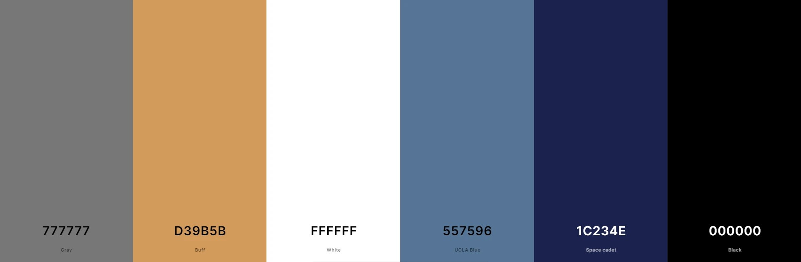
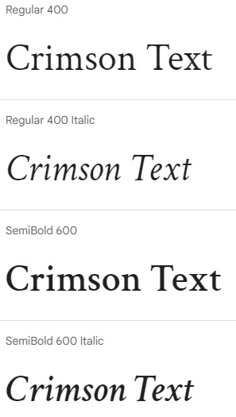
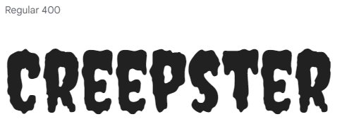

<h1 align="center"><strong>🎃🎃🎃 Phantom Forge: A Halloween Hackathon 🎃🎃🎃</strong>

</h1>

# DID YOU HEAR THAT? 
## by the GhoulGroovers 
 
### Deployment
The project is deployed and can be accessed at [Didyouhearthat](https://ktc96.github.io/Didyouhearthat/).

## ABOUT 
### Intro
This quiz tests the user's knowledge of Spooky Halloween Sounds. 

Listen to the audio and see if you know how the sound was made.

### Goal
- The goal of this project was to create an interactive Halloween themed quiz. 

- It provides a fun and challenging way for users to test how well they know the classic Halloween sound effects from their favourite spooky films.

- The target audience for this project is anyone who has seen a Halloween film.

- The quiz is an entertaining twist on the classic JavaScript quiz allowing the user to get into the Halloween spirit with its on theme styling and design.

### Collaborators 

- Scrum Master - Rachel Walmsley
- Kyle Clow
- Ulrike
- Sarah Barter
- Natalia Czeladka
- Alexander Lungu

### Features

- Nav Bar
- Quiz rules
- Username input
- Quiz Start Section
- Quiz End Section

### Future Features

### Design

#### Colour Scheme
The colour scheme of "Did you hear that?" Halloween Sounds Quiz was generated from its background picture. Because it plays a crucial role in setting the tone and atmosphere of the app, we all wanted to introduce colours commonly associated with Halloween, such as black, grey, and orange. Keeping the page simple and clear was our high priority, so choosing the classic combination of black and white was a pretty obvious choice here. A few subtle shades of grey and blue emphasize the dark night design, but the cherry on the cake and the strongest colour accent of the website is a mid-toned, golden ochre shade called buff, our subdued equivalent of flashy orange.

We used [Coolors](https://coolors.co/777777-d39b5b-ffffff-557596-1c234e-000000) to generate our colour palette.

#### Typography 
To emphasize the contrast between different level headings, we have carefully selected two different fonts. They are both Google Fonts, but that's where the similarities end. The fonts were paired to enhance the visual hierarchy of the website and highlight essential information.

- The [Crimson Text](https://fonts.google.com/specimen/Crimson+Text?query=crimson+) font is the primary font used throughout the entire website, with Serif as the fallback font. It's a clean and legible font that ensures easy readability. We mainly used it to provide text content for paragraphs, quiz answers, and short notes (e.g., in the footer).

- The [Creepster](https://fonts.google.com/specimen/Creepster?query=creepster) font was used for almost all of the main headings and the logo. It's a bold and eye-catching font that easily draws attention, also a perfect match for our Halloween theme with its spooky curves and horror-related design.

- [Font Awesome](https://fontawesome.com/) icons were used for social media links and spider-shaped bullet points.

### Wireframes

### Technologies Used

#### Languages Used

- [HTML](https://en.wikipedia.org/wiki/HTML) - used for the main site content.
- [CSS](https://en.wikipedia.org/wiki/CSS) - used for the main site design and layout.
- [JavaScript](https://www.javascript.com) - used for user interaction on the site.

#### Frameworks, Libraries and Programs Used

- [Am I responsive?](https://ui.dev/amiresponsive) - used to check the site's responsiveness and to create mockups.
- [Bootstrap v5.3](https://getbootstrap.com/) - used to assist with responsiveness by utilizing its components and layout elements.
- [Coolors](https://coolors.co/) - used to create the colour palette.
- [Font Awesome](https://fontawesome.com/) - used to provide icons across the website.
- [Free Convert](https://www.freeconvert.com/jpg-to-webp) - used to convert jpg/png images to webp format.
- [Google Chrome Dev Tools](https://developer.chrome.com/docs/devtools/) - used to inspect and debug the code.
- [Google Fonts](https://fonts.google.com/) - used to import the fonts that style all of the text content.
- [Git](https://git-scm.com/) - used for version control by utilizing VS Code's terminal.
- [GitHub](https://github.com/) - used to store the project's code and images in the repository.
- [GitHub Pages](https://pages.github.com/) - used to deploy the website.
- [Icon-Icons](https://icon-icons.com/) - used to provide the favicon.
- [Tiny.png](https://tinypng.com/) - used to reduce the size of the image files.
- [Visual Studio Code](https://code.visualstudio.com/) - used as a code editor.

### Testing
- HTML - https://validator.w3.org/ 
- CSS - https://jigsaw.w3.org/css-validator/ 
- JavaScript - https://jshint.com/

### Test Cases

### Deployment

#### Deploying the project to GitHub Pages

1. Log in to your GitHub account and locate the repository you would like to deploy.
2. Navigate to the "Settings" tab at the top of your selected repository.
3. Select "Pages" from the menu on the left-hand side of the screen.
4. Make sure the "Select" dropdown menu shows "Deploy from a branch".
5. From the "Branch" dropdown menu select "Main" and click "Save".
6. The page will automatically refresh and display the link to your deployed website.

#### Forking the GitHub repository

By forking the repository, you make a copy of the original repository on your GitHub account to view or to make changes to, without affecting the original repository.

1. Log in to your GitHub account and locate the repository you would like to fork.
2. At the top of the repository on the right-hand side of the screen, locate the "Fork" button.
3. After clicking on it, you should have your own copy of the original repository in your GitHub account.

#### Making a local clone

Making a clone is basically making a copy of the selected repository.

1. Log in to your GitHub account and locate the repository you would like to clone.
2. Click on the "Code" button just under the repository name.
3. Copy the HTTPS link from the website address bar.
4. Open a GitBash terminal and locate the directory where you want to place the clone.
5. Type 'git clone' and then paste the URL you copied earlier.
6. Press enter. Then your local clone will be created.

### Credits

#### Code from the team's projects
The team combined code from personal quiz projects - https://github.com/KTC96/TheGreenDragonPubQuiz/blob/main/assets/JS/script.js, https://github.com/URiem/geography-game/blob/main/assets/js/script.js, https://github.com/barty-s/art-quiz-app/blob/main/assets/js/script.js

