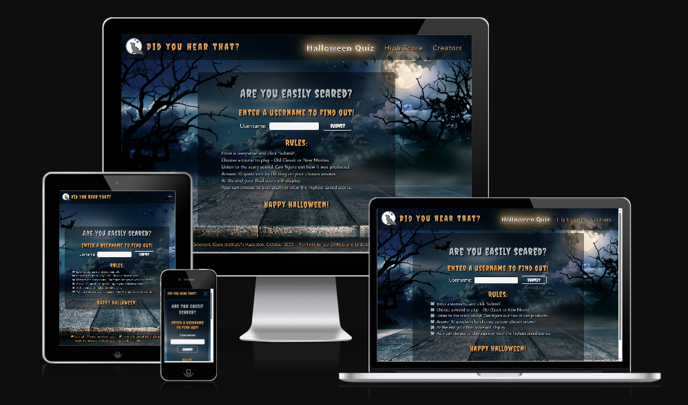

<h1 align="center"><strong>🎃🎃🎃 Phantom Forge: A Halloween Hackathon 🎃🎃🎃</strong>

</h1>

# DID YOU HEAR THAT? TESTING 

## Functionality Manual Testing

### Navbar - all pages

- Logo and title take you to welcome screen
- Drop down button is visible on smaller screens
- Dropdown button provides links to Halloween Quiz, Creators and HighScore
- On larger screens the links are all visible without a dropdown and change size when hovered over.
- Current page on nav bar links is white to confirm which page you are on
- Links take you to correct place when clicked

### Footer - all pages

- Link to creators changes colour when hovered over
- Link to creators page takes you to correct place

### Welcome screen

#### Username Input

- Input can't be blank as it is required to move on but provides an appropriate error message when attempting to leave blank
- Input takes letters on the screen 
- User's name is saved in local storage when submit is clicked

#### Instructions

- Clear accurate instructions are visible on welcome page

#### Moves to second menu when submit is clicked

- On clicking submit on the welcome page it moves to a menu

### Menu Page

#### Menu Buttons

- Menu button change size and light up when hovered over.
- Menu buttons take you through to the appropriate part of the quiz

### Quiz page

#### Embedded Audio

- Auto plays when the question is asked
- Plays relevant sound for the question
- Replay button provides the sound again
- Slight shadow is visible behind replay button
- Total time associated with audio clip is correct
- Current part of audio clip time is correct
- Mute button for the audio clips replaying works
- Volume control for  the audio clips works
- Mute and volume control for the audio clips does not affect the scare sound
- Download option on three dots downloads the file
- Speed adjust option on the three dots adjusts the speed correctly

#### Answer buttons

- When hovered over button changes size and glows
- When clicked button changes moves you to the next question
- When clicked button activates score increment 

#### Score Display

- When a question is answered either correct or incorrect score increments
- Score is easily read throughout the game

### End Score Display

#### Score and messages

- Score is displayed for 2 seconds before automatically moving to end_game.html
- A personalised message using the name entered by the user is displayed accompanied by their final score and which round they were playing
- Depending on the score correct message is put on the screen, congratulating them or suggesting that they do better.

#### Replay with same user name button

- Button to replay takes you back to choose which round

#### Replay with different user name button

- Button to replay takes you back to enter a new username

#### High scores button

- Takes you to high score page

### Creators Page

#### Links

- All links are correctly connected when clicked

### High scores

#### Username Output

- Name put in at beginning of game is visible when the page loads against the score in the table
- Each time you play it adds your username and score if you are in the top three player
- Old scores retained

### Scares

- Scares and appropriate audio appear randomly throughout game play
- Epilepsy warning alert box appears at the beginning of game play to ensure that game is not played by 
epileptics who might be triggered by scares

### Floating ghost

- Floating ghost moves around the screen as expected throughout game play

### Theme tune on appropriate pages

- Theme tune is not playing during game play so that you can hear the audio questions
- Theme tune plays on loading of pages (except during game)

### Responsive

The game is easily accessed on different screen sizes with the nav bar changing to drop down and text and container sizes adapting appropriately. 

